# FinWallet — Database ERD

## Entity Relationship Diagram

```mermaid
erDiagram

    %% ─── AUTH ───────────────────────────────────────────────
    users {
        uuid        id              PK
        varchar     name
        varchar     email           UK
        varchar     password_hash
        boolean     email_verified
        timestamp   created_at
        timestamp   updated_at
    }

    refresh_tokens {
        uuid        id              PK
        uuid        user_id         FK
        varchar     token           UK
        timestamp   expires_at
        timestamp   created_at
    }

    %% ─── WALLETS ────────────────────────────────────────────
    wallets {
        uuid        id              PK
        uuid        owner_id        FK
        varchar     name
        text        description
        char        currency        "ISO 4217 e.g. USD"
        varchar     color
        varchar     icon
        timestamp   created_at
        timestamp   updated_at
    }

    wallet_members {
        uuid        id              PK
        uuid        wallet_id       FK
        uuid        user_id         FK
        uuid        invited_by      FK
        enum        role            "editor | viewer"
        timestamp   created_at
    }

    %% ─── TRANSACTIONS & CATEGORIES ─────────────────────────
    categories {
        uuid        id              PK
        uuid        user_id         FK
        varchar     name
        enum        type            "income | expense"
        varchar     icon
        boolean     is_default
        timestamp   created_at
        timestamp   updated_at
    }

    transactions {
        uuid        id              PK
        uuid        wallet_id       FK
        uuid        category_id     FK
        uuid        created_by      FK
        enum        type            "income | expense"
        decimal     amount          "DECIMAL(15,2)"
        text        description
        date        date
        timestamp   created_at
        timestamp   updated_at
    }

    %% ─── BUDGETS ────────────────────────────────────────────
    budgets {
        uuid        id              PK
        uuid        wallet_id       FK
        uuid        category_id     FK
        uuid        created_by      FK
        decimal     amount          "DECIMAL(15,2)"
        enum        period          "weekly | monthly | yearly"
        timestamp   created_at
        timestamp   updated_at
    }

    %% ─── GOALS ──────────────────────────────────────────────
    goals {
        uuid        id              PK
        uuid        user_id         FK
        varchar     name
        text        description
        decimal     target_amount   "DECIMAL(15,2)"
        date        deadline
        varchar     icon
        varchar     color
        enum        status          "active | completed | paused"
        timestamp   created_at
        timestamp   updated_at
    }

    goal_contributions {
        uuid        id              PK
        uuid        goal_id         FK
        decimal     amount          "DECIMAL(15,2)"
        text        note
        date        date
        timestamp   created_at
    }

    %% ─── SAVINGS ────────────────────────────────────────────
    savings_accounts {
        uuid        id              PK
        uuid        user_id         FK
        varchar     name
        decimal     interest_rate   "DECIMAL(5,2) — annual %"
        enum        compounding     "monthly | quarterly | annually"
        char        currency        "ISO 4217"
        varchar     icon
        varchar     color
        timestamp   created_at
        timestamp   updated_at
    }

    savings_transactions {
        uuid        id              PK
        uuid        savings_account_id  FK
        enum        type            "deposit | withdrawal"
        decimal     amount          "DECIMAL(15,2)"
        text        note
        date        date
        timestamp   created_at
    }

    %% ─── INVESTMENTS ────────────────────────────────────────
    investments {
        uuid        id              PK
        uuid        user_id         FK
        varchar     name
        varchar     ticker
        enum        type            "stock | crypto | etf | mutual_fund | bond | real_estate | other"
        decimal     quantity        "DECIMAL(18,8) — supports crypto fractions"
        decimal     purchase_price  "DECIMAL(15,2)"
        decimal     current_price   "DECIMAL(15,2)"
        char        currency        "ISO 4217"
        date        purchase_date
        text        notes
        timestamp   created_at
        timestamp   updated_at
    }

    %% ─── RELATIONSHIPS ──────────────────────────────────────
    users               ||--o{    wallets             : "owns"
    users               ||--o{    wallet_members      : "is member of"
    wallets             ||--o{    wallet_members      : "has"
    users               ||--o{    refresh_tokens      : "has"
    users               ||--o{    categories          : "defines"
    users               ||--o{    transactions        : "creates"
    users               ||--o{    budgets             : "creates"
    users               ||--o{    goals               : "sets"
    users               ||--o{    savings_accounts    : "owns"
    users               ||--o{    investments         : "holds"
    wallets             ||--o{    transactions        : "contains"
    wallets             ||--o{    budgets             : "has"
    categories          ||--o{    transactions        : "classifies"
    categories          ||--o{    budgets             : "limits spending in"
    goals               ||--o{    goal_contributions  : "receives"
    savings_accounts    ||--o{    savings_transactions : "records"
```



---

## Table Notes & Design Decisions

### `users`
- `password_hash` — bcrypt (cost factor 12). Never store plain text.
- `email_verified` — gate login until email is confirmed.
- Email stored lowercase, unique index.

### `refresh_tokens`
- Separate table enables **token rotation** — invalidate all sessions (logout everywhere) by deleting rows.
- `expires_at` — 30-day rolling window; access tokens short-lived (15 min).

### `wallets` + `wallet_members`
- `owner_id` points to the wallet creator; ownership is separate from membership.
- `wallet_members` has a **composite unique constraint** on `(wallet_id, user_id)` — prevents duplicate memberships.
- `invited_by` — audit trail: who granted access.
- `role` enum: `editor` (read + write transactions) | `viewer` (read only).

### `categories`
- Seeded with defaults (`is_default = true`) on first login, then fully user-editable.
- Scoped per user — categories are not shared across users even on shared wallets.
- Transactions reference `category_id` (FK) rather than storing the name string — allows safe renaming.

### `transactions`
- `DECIMAL(15,2)` — never use `FLOAT` for money (floating-point rounding errors).
- `category_id` is nullable — handles transactions created before a category was deleted.
- `created_by` — audit trail for shared wallets (who added this transaction).

### `budgets`
- Composite unique constraint on `(wallet_id, category_id, period)` — one budget per category per period per wallet.
- Spending is calculated at query time (sum of transactions in the period) — not stored, so it stays accurate.

### `goals`
- `status` enum leaves room for a `paused` state (user stops contributing temporarily).
- `target_amount` is immutable once set in the UI; update is allowed only via edit.

### `goal_contributions`
- Append-only — no updates or soft deletes. Provides a clean audit trail of every deposit.
- Balance = `SUM(amount)`. Auto-complete trigger when balance ≥ target.

### `savings_accounts`
- `interest_rate DECIMAL(5,2)` — allows values like `4.75` (%). Max 99.99%.
- Projected growth is always **computed at runtime** from the stored rate + balance sum.

### `investments`
- `quantity DECIMAL(18,8)` — 8 decimal places to support crypto (e.g. 0.00032847 BTC).
- `current_price` updated manually by the user (no market data API yet — Phase 2).
- `purchase_price` is immutable once set — cost basis for ROI calculation.

---

## Indexes (performance)

| Table | Index |
|---|---|
| `users` | `email` (unique) |
| `wallets` | `owner_id` |
| `wallet_members` | `(wallet_id, user_id)` unique, `user_id` |
| `transactions` | `wallet_id`, `date`, `(wallet_id, date)` composite |
| `categories` | `user_id` |
| `budgets` | `(wallet_id, category_id, period)` unique |
| `goals` | `user_id`, `status` |
| `goal_contributions` | `goal_id` |
| `savings_accounts` | `user_id` |
| `savings_transactions` | `savings_account_id`, `date` |
| `investments` | `user_id`, `type` |
| `refresh_tokens` | `token` (unique), `user_id` |

---

## Constraints Summary

```sql
-- Prevent duplicate wallet members
UNIQUE (wallet_members.wallet_id, wallet_members.user_id)

-- One budget per category per period per wallet
UNIQUE (budgets.wallet_id, budgets.category_id, budgets.period)

-- All monetary amounts must be positive
CHECK (transactions.amount > 0)
CHECK (budgets.amount > 0)
CHECK (goals.target_amount > 0)
CHECK (goal_contributions.amount > 0)
CHECK (savings_transactions.amount > 0)
CHECK (investments.quantity > 0)
CHECK (investments.purchase_price > 0)
CHECK (investments.current_price > 0)
```

---

## Next Step → Prisma Schema

Once this ERD is approved, the next step is translating this into a
`schema.prisma` file (Prisma ORM) and running the first migration against
a PostgreSQL database.
